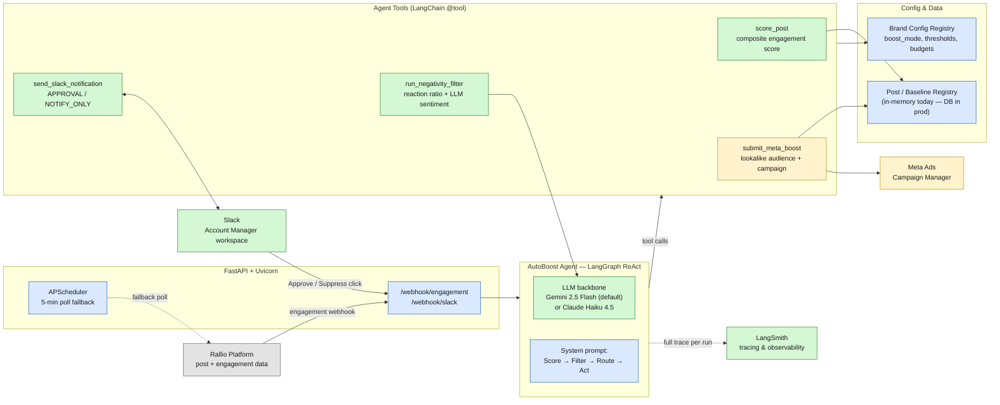

# AutoBoost Agent — Architecture

System architecture of the AutoBoost agent: the AI agent, its tools, and the
external systems it integrates with.

**Legend:** 🟩 live & working today · 🟦 core orchestration/config · 🟨 stubbed (mock data, ready to swap for real API) · ⬜ external system

## Tech stack

| Layer | Technology | Status |
|---|---|---|
| Agent orchestration | LangGraph (`create_react_agent`) + LangChain | Live |
| LLM backbone | Gemini 2.5 Flash (default, free tier) / Claude Haiku 4.5 | Live, swappable via `.env` |
| Web server | FastAPI + Uvicorn | Live |
| Scheduling | APScheduler (5-min polling fallback) | Live |
| Config & validation | Pydantic / pydantic-settings | Live |
| Observability | LangSmith (per-run traces of every LLM call & tool call) | Live |
| Notifications & approvals | Slack SDK (real bot token + channel) | Live |
| Ad platform | Meta Ads | Stubbed — mock campaign IDs, drop-in ready for Meta Ads MCP |
| Source platform | Rallio | Mocked client + sample data — drop-in ready for Rallio webhooks/API |
| Package management | uv | Live |

## Agent & tools

The system runs a **single LangGraph ReAct agent** ("AutoBoost") per post event. Given a `post_id` and `brand_id`, its system prompt drives a fixed decision sequence using four tools:

1. **`score_post`** — computes a composite engagement score (comments 30% · shares 25% · saves 20% · reach velocity 15% · likes 10%) against the location's 90-day baseline. If below the brand's threshold, the agent stops here.
2. **`run_negativity_filter`** — two-stage gate: a reaction-ratio check (angry/sad reactions > 20%) and an LLM-based sentiment check on comments (negative > 30%). If either fails, the agent stops and logs a suppression reason.
3. **`send_slack_notification`** — routes by the brand's `boost_mode`:
   - `APPROVAL` sends an interactive Slack card and awaits an Approve/Suppress click (with a configurable timeout).
   - `NOTIFY_ONLY` sends a fire-and-forget performance alert.
4. **`submit_meta_boost`** — builds a dynamic lookalike audience from the post's organic engagers and submits a paid boost campaign with the brand's configured budget.

Every brand is independently configured (`config/brand_config.py`) for `boost_mode`, `score_threshold`, `monthly_budget_cap`, `default_boost_budget`, and `approval_timeout_mins` — so different franchise brands can run fully autonomous, human-in-the-loop, or alert-only.
