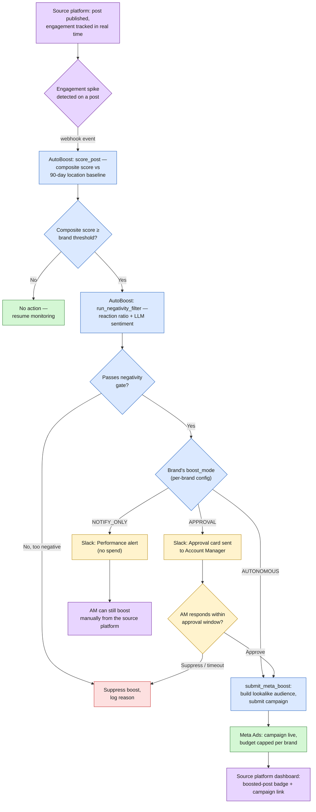

# AutoBoost in a Social Platform — End-to-End Flow

How AutoBoost would sit inside a social media management product: a post's
engagement is monitored in real time, scored, sentiment-checked, and routed
to the action appropriate for that brand — with the source platform as both
the trigger and the place results surface back to.

**Legend:** 🟪 source platform touchpoint (today or proposed) · 🟦 AutoBoost agent step · 🟨 Account Manager / Slack · 🟩 successful outcome · 🟥 suppressed outcome

## Why this matters for a source platform

- **Closes the 3–5 day gap** between a post going viral and an ad actually running — AutoBoost reacts within minutes of an engagement spike.
- **Per-brand control, not all-or-nothing**: a brand can run fully `AUTONOMOUS`, require human `APPROVAL` via Slack, or just get `NOTIFY_ONLY` alerts — the platform decides the trust level per franchise.
- **Built-in guardrails**: nothing spends money until it passes both an engagement threshold *and* a negativity filter, and every brand has a hard monthly budget cap.
- **The source platform stays the system of record**: the proposed loop-back (🟪 boxes) shows boosted posts and campaign links surfaced directly in the platform dashboard, and account managers retain the ability to boost manually at any time.

## Today vs. proposed

| Step | Status |
|---|---|
| Engagement webhook trigger | Mocked (`integrations/social_platform.py`) — ready for a real platform webhook |
| Scoring, negativity filter, mode routing | **Working today**, demoed live |
| Slack notification (`NOTIFY_ONLY`) | **Working today** with real Slack workspace |
| Slack approval (`APPROVAL`) | Working today via simulated webhook callback; needs public endpoint (e.g. ngrok) for live Slack button clicks |
| Meta Ads boost submission | Stubbed with realistic mock IDs — ready for Meta Ads MCP |
| Source platform dashboard loop-back | Proposed — not yet built |
